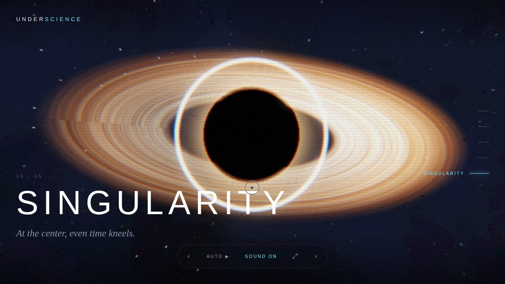
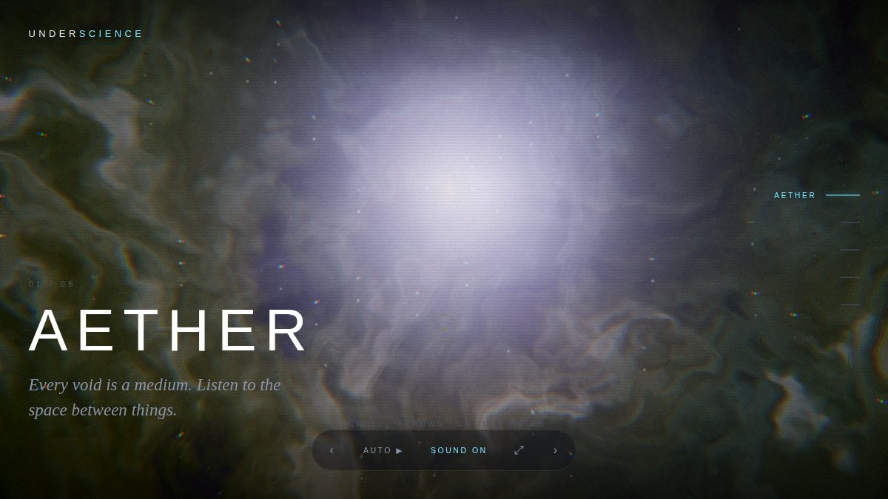
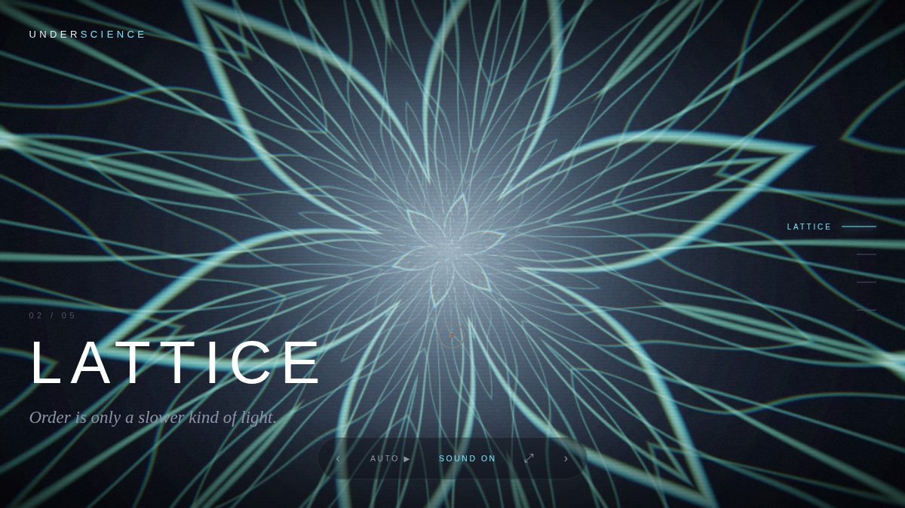
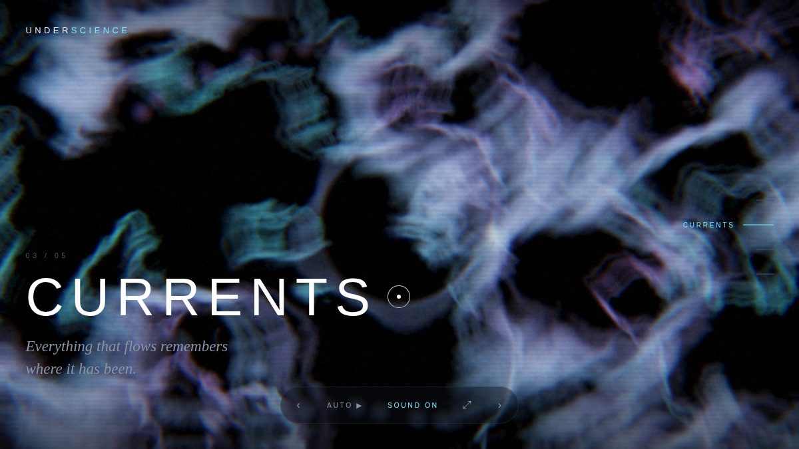
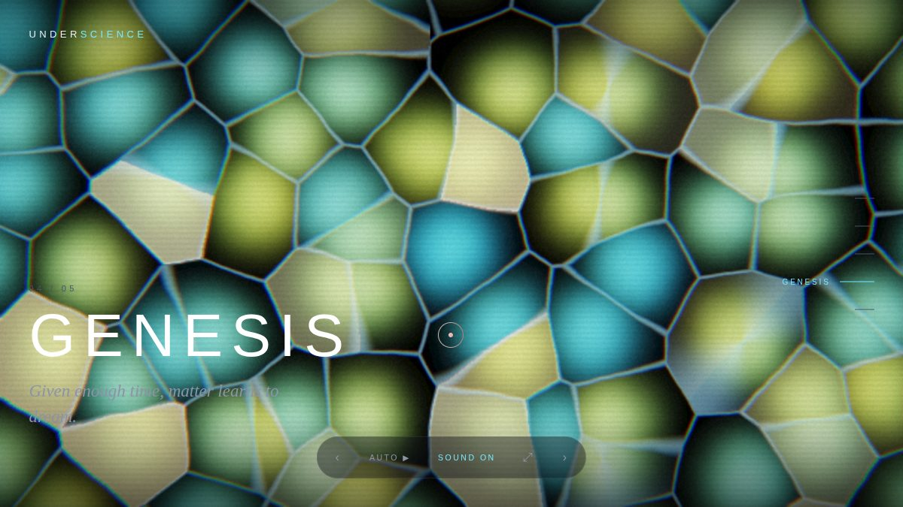

<div align="center">

# ✦ UNDERSCIENCE

### *the science beneath the surface*

**A fully procedural, audio-reactive WebGL experience.**
There are no image files and no audio recordings anywhere in this project —
**every pixel and every sound is generated in real time, in code.**



</div>

---

## What it is

UNDERSCIENCE is an interactive audiovisual journey through five generated
"worlds." Each world is a hand-written GLSL shader running on the GPU, set to
a self-composing ambient soundtrack synthesised live in the browser. The music
listens to itself and feeds its bass / mid / treble / beat back into the
shaders, so the visuals breathe with the sound.

Open it, press **enter**, and either steer it or let it drift on autopilot like
an installation.

> Built from an empty repository in a single night. Zero runtime dependencies,
> zero build step. Double-click `index.html` and it runs.

## The five worlds

| | | |
|---|---|---|
| **01 · Aether** — a domain-warped nebula drifting in deep space | **02 · Lattice** — a crystalline mandala of luminous filaments | **03 · Currents** — luminous ink advected through an invisible fluid |
|  |  |  |

| | |
|---|---|
| **04 · Genesis** — a living sheet of cells that fire on the beat | **05 · Singularity** — a gravitationally-lensed black hole |
|  |  |

*(Stills don't do it justice — it's all in motion, and it reacts to the sound.)*

## Run it

The experience is pure static files with **no dependencies and no build**:

```bash
# option A — just open it
open index.html            # macOS  (or double-click the file)

# option B — serve it (nicer URL, identical result)
node serve.js              # -> http://localhost:8080
```

Then press **enter** (this also unlocks audio — browsers require a click first).
Headphones recommended.

## Controls

| Action | Keys / gestures |
|---|---|
| Next / previous world | `→` `←` · scroll · swipe · arrows on screen |
| Jump to a world | number keys `1`–`5` · the rail on the right |
| Toggle autopilot | `A` |
| Mute / unmute | `M` |
| Fullscreen | `F` |
| Steer the visuals | move the mouse (parallax) — idle, it drifts on its own |

## How it works

```
index.html
├─ src/gl/shaders.js        shared GLSL toolbox (noise, fbm, curl, palettes, ACES…)
├─ src/gl/worlds/*.js       the five fragment-shader worlds
├─ src/gl/post/post.js      bloom · chromatic aberration · grain · vignette · tonemap
├─ src/gl/renderer.js       WebGL1 engine: FBO ping-pong, feedback, GPU crossfades
├─ src/audio/engine.js      Web Audio generative soundtrack + analyser → shader uniforms
├─ src/ui/*.js              kinetic typography · custom cursor
└─ src/main.js              orchestration: loop, navigation, autopilot, input
```

**Rendering.** A tiny hand-rolled WebGL1 engine draws a fullscreen triangle
through the active world shader into a ping-pong framebuffer (so feedback worlds
like *Currents* can read the previous frame), then runs a post chain:
threshold → separable gaussian bloom → composite with chromatic aberration,
film grain, vignette and ACES tone-mapping. World-to-world transitions are GPU
crossfades from a frozen copy of the outgoing frame.

**Sound.** No audio files. A lookahead scheduler weaves a drone, evolving chord
pads, sparse bell tones and a sub-pulse heartbeat from each world's scale and
mood. An `AnalyserNode` taps the final mix and exposes `bass / mid / treble /
beat`, which become shader uniforms — that's the audio-reactivity.

**It targets WebGL1 / GLSL ES 1.00** for maximum device compatibility (no
extensions required) and adapts resolution to keep the framerate up. There's a
graceful fallback if WebGL is unavailable, and it honours
`prefers-reduced-motion`.

## Developing

The experience needs nothing installed. The **tooling** does — and it's how this
was built without a screen to look at:

```bash
npm install                 # dev-only: headless-gl + playwright-core

npm run validate            # compile-test every shader against a real WebGL driver
npm run capture             # headless-Chromium smoke test + screenshots
npm run gallery             # regenerate the README gallery
```

`validate` compiles every shader program with [`gl`](https://github.com/stackgl/headless-gl)
(run under `xvfb`) so a broken shader fails CI-style instead of silently
rendering black. `capture` loads the real page in headless Chromium with
software WebGL, asserts there are no runtime errors, and screenshots each world.

## License

MIT — see [LICENSE](LICENSE). Make something strange with it.

---

<div align="center">
<sub>

*Feito numa noite, enquanto você dormia.* ✦

</sub>
</div>
